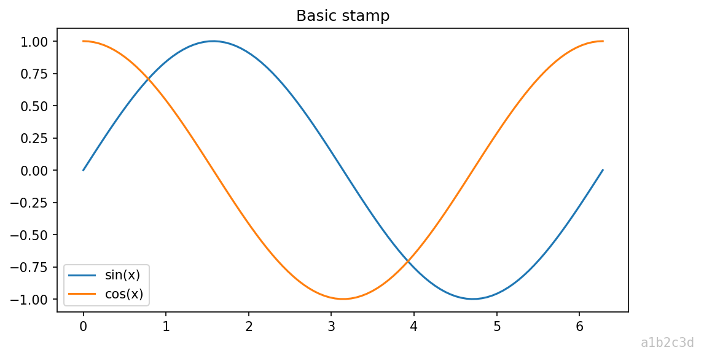
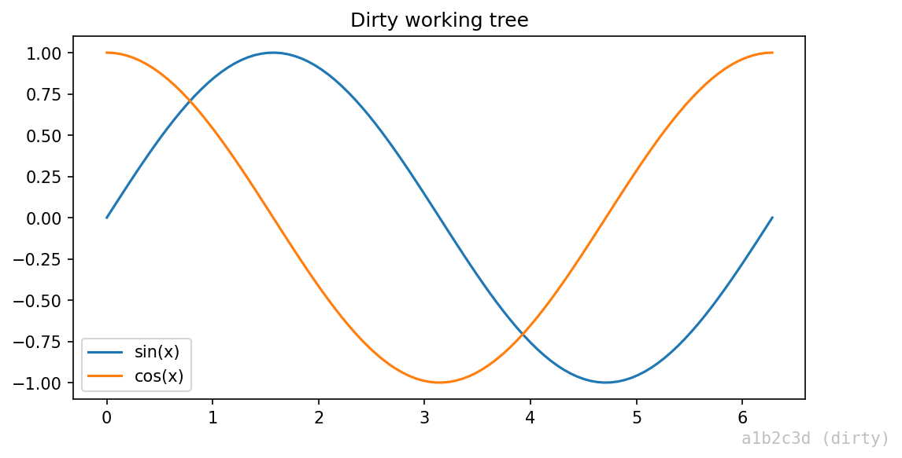
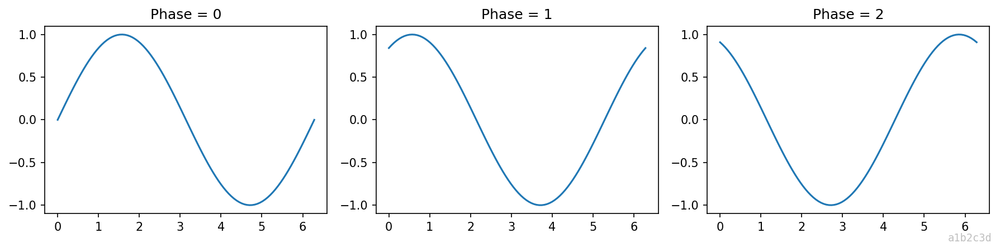
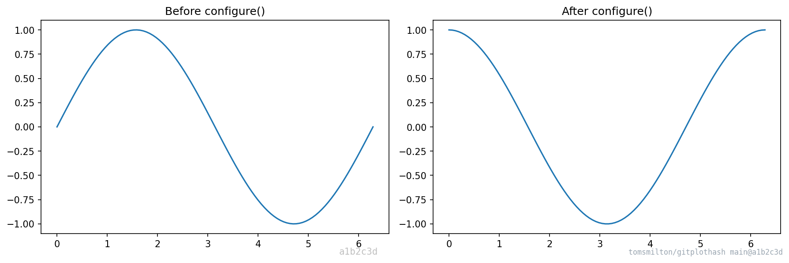
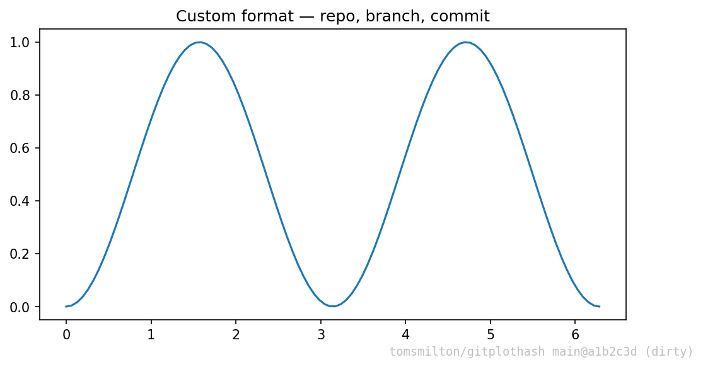
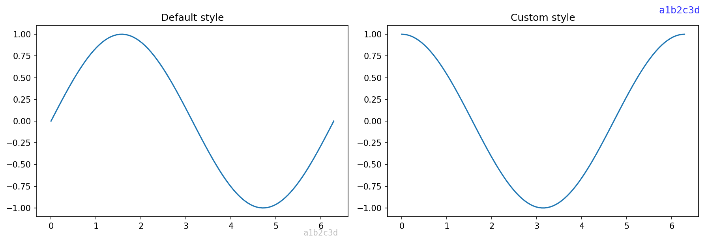
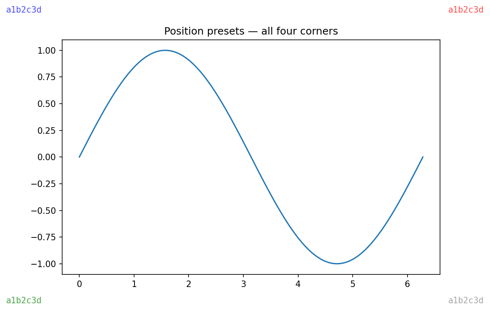

Stamp your matplotlib plots with the current git commit hash so you can always trace which version of your code produced a figure. Designed for Jupyter notebook workflows where you're iterating on analysis for a paper.

Shows the short commit hash and flags uncommitted changes as `(dirty)`.

## Install

```bash
pip install git+ssh://git@github.com/tomsmilton/gitplothash.git
```

Or for local development:

```bash
git clone git@github.com:tomsmilton/gitplothash.git
cd gitplothash
pip install -e .
```

## Quick Start

```python
import matplotlib.pyplot as plt
import gitmatplotlib

plt.plot([1, 2, 3], [1, 4, 9])
gitmatplotlib.stamp()
plt.show()
```

This adds a small annotation like `a1b2c3d` (or `a1b2c3d (dirty)` if there are uncommitted changes) in the bottom-right corner of your figure.

| Clean | Dirty |
|---|---|
|  |  |

## Features

### `stamp(target, ...)`

Add a git commit annotation to a matplotlib figure. Accepts a `Figure`, `Axes`, or `None` (uses `plt.gcf()`). Returns the `matplotlib.text.Text` artist for further customisation.

```python
gitmatplotlib.stamp()                # stamp current figure
gitmatplotlib.stamp(fig)             # stamp a specific figure
gitmatplotlib.stamp(ax)              # stamp the axes' parent figure
```

If not inside a git repo, `stamp()` silently does nothing. Pass `strict=True` to raise a `GitNotFoundError` instead.

Works with subplots too — the stamp goes on the figure, not individual axes:



### `configure(...)` / `reset_config()`

Set default options once at the top of a notebook. All subsequent `stamp()` calls (including via `enable()`) use these defaults. Any argument passed directly to `stamp()` still takes precedence.

```python
gitmatplotlib.configure(
    fmt="{repo} {branch}@{commit}{dirty}",
    fontsize=8,
    color="slategray",
    alpha=0.7,
    auto_commit=True,
)

# All subsequent stamps use those defaults
gitmatplotlib.stamp()

# Override just one option per-call
gitmatplotlib.stamp(color="red")

# Reset back to built-in defaults
gitmatplotlib.reset_config()
```



### `enable(...)` / `disable()`

Auto-stamp every plot in a Jupyter notebook. Call `enable()` once and all subsequent figures are stamped automatically — no explicit `stamp()` call needed. Works with `plt.show()`, `fig.savefig()`, and Jupyter's inline backend.

```python
gitmatplotlib.enable()

# All plots from here on are auto-stamped
plt.plot([1, 2, 3])
plt.show()  # stamped automatically

# Pass options to customise the auto-stamp
gitmatplotlib.enable(fmt="{repo}@{commit}{dirty}", color="darkgreen")

# Stop auto-stamping
gitmatplotlib.disable()
```

`enable()` also picks up any defaults set via `configure()`.

### `auto_stamp(...)`

Context manager that auto-stamps figures within a `with` block only. Useful when you want auto-stamping for a specific section rather than the whole notebook.

```python
with gitmatplotlib.auto_stamp(fontsize=8):
    plt.plot([1, 2, 3])
    plt.show()  # stamped

plt.plot([4, 5, 6])
plt.show()  # NOT stamped — outside the block
```

### `auto_commit` option

Automatically `git add -A && git commit` before stamping, so the commit hash always points to a clean snapshot of the code that produced the plot. Available on `stamp()`, `configure()`, and `enable()`.

```python
# Per-call
gitmatplotlib.stamp(auto_commit=True)

# As a default for all stamps
gitmatplotlib.configure(auto_commit=True)

# With auto-stamp
gitmatplotlib.enable(auto_commit=True)
```

The commit message defaults to `"gitmatplotlib: auto-snapshot"` — customise it with the `commit_message` option. If the tree is already clean, no commit is created.

### `auto_commit(repo_path, message)`

Standalone function to stage and commit all changes programmatically. Returns `True` if a commit was created, `False` if the tree was already clean.

```python
created = gitmatplotlib.auto_commit()
```

### `get_git_info(repo_path)`

Get a `GitInfo` dataclass with details about the current git state:

```python
info = gitmatplotlib.get_git_info()
info.commit   # "a1b2c3d" — short commit hash
info.dirty    # True/False — uncommitted changes
info.branch   # "main" — current branch (None if detached HEAD)
info.repo     # "owner/repo" — parsed from remote URL, or directory name

# Format into a custom label
info.label(fmt="{repo} {branch}@{commit}{dirty}")
# → "tomsmilton/gitplothash main@a1b2c3d (dirty)"
```

## Customisation options

All options below are available on `stamp()` and `configure()`:

| Option | Default | Description |
|---|---|---|
| `fmt` | `"{commit}{dirty}"` | Format string. Placeholders: `{commit}`, `{dirty}`, `{branch}`, `{repo}` |
| `dirty_marker` | `" (dirty)"` | What `{dirty}` expands to when the tree is dirty |
| `pos` | `(0.99, 0.01)` | Position in figure coordinates (0–1). Bottom-right by default |
| `ha` | `"right"` | Horizontal alignment: `"left"`, `"center"`, `"right"` |
| `va` | `"bottom"` | Vertical alignment: `"top"`, `"center"`, `"bottom"` |
| `fontsize` | `10` | Font size in points |
| `color` | `"gray"` | Text colour |
| `alpha` | `0.5` | Transparency (0–1) |
| `fontfamily` | `"monospace"` | Font family |
| `repo_path` | cwd | Path to the git repository |
| `auto_commit` | `False` | Stage and commit before stamping |
| `commit_message` | `"gitmatplotlib: auto-snapshot"` | Commit message for auto-commits |
| `strict` | `False` | Raise `GitNotFoundError` instead of silently skipping |

### Format string examples



### Style comparison



### Common position presets

```python
# Bottom-right (default)
gitmatplotlib.stamp(pos=(0.99, 0.01), ha="right", va="bottom")

# Top-left
gitmatplotlib.stamp(pos=(0.01, 0.99), ha="left", va="top")

# Top-right
gitmatplotlib.stamp(pos=(0.99, 0.99), ha="right", va="top")

# Bottom-left
gitmatplotlib.stamp(pos=(0.01, 0.01), ha="left", va="bottom")
```



## API summary

| Function | Description |
|---|---|
| `stamp(target, ...)` | Add git info annotation to a figure |
| `configure(...)` | Set default options for all subsequent stamps |
| `reset_config()` | Reset defaults back to built-in values |
| `enable(...)` | Auto-stamp all plots (hooks `show`, `savefig`, and IPython) |
| `disable()` | Stop auto-stamping |
| `auto_stamp(...)` | Context manager for auto-stamping within a block |
| `auto_commit(...)` | Stage and commit all changes if the tree is dirty |
| `get_git_info(...)` | Get a `GitInfo` object with commit, dirty, branch, repo |
